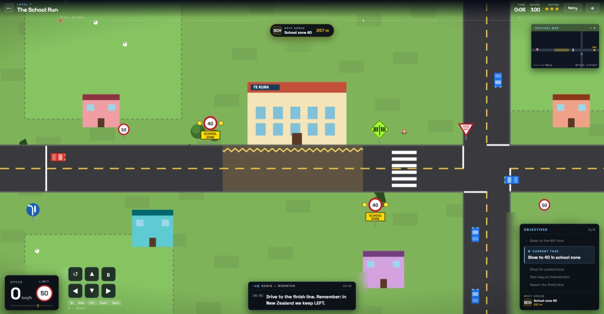

# NZ Road Safety Challenge

A top-down New Zealand road-safety driving game built with **React + Vite**. Includes four complete levels featuring school zones, pedestrian crossings, roundabouts, one-lane bridges, and more. The overlay uses a tactical dispatch-style HUD.

**🚀 Try it out on GitHub Pages: [https://softeng701-2026.github.io/group2-nz-road-safety-game/](https://softeng701-2026.github.io/group2-nz-road-safety-game/)**



## Levels

1.  **Suburban Streets**: School zones, pedestrian crossings & give-way.
2.  **City Commute**: Roundabouts, pedestrian crossings & urban intersections.
3.  **Rural Road Trip**: Railway crossings, one-lane bridges & gravel roads.
4.  **Mountain Pass**: Icy roads, bridges, rail crossings & give-way — the full test.

## Quick Start

```bash
git clone <your-repo-url>
cd <repo-folder>
npm install
npm run dev
```

The dev server runs at `http://localhost:5173` by default. Edit files under `src/` and Vite will reload the app.

## Scripts

| Command           | What it does                                      |
| ----------------- | ------------------------------------------------- |
| `npm run dev`     | Start the Vite dev server with hot reload         |
| `npm run build`   | Build the production bundle into `dist/`          |
| `npm run preview` | Serve the built `dist/` locally for a quick check |

## Controls

| Key              | Action        |
| ---------------- | ------------- |
| `Up` / `W`       | Accelerate    |
| `Down` / `S`     | Reverse       |
| `Left` / `A`     | Steer left    |
| `Right` / `D`    | Steer right   |
| `Space`          | Brake         |
| `R`              | Reset the run |

## File Map

```text
src/
  main.jsx              Vite entry; mounts <App>
  App.jsx               Root component (handles level selection)
  HomePage.jsx          Level selection menu
  index.css             Global page styles

  engine/               Game logic
    constants.js        World dimensions and key positions
    units.js            px-to-km/h conversion
    geofence.js         Road, lane, and zone checks
    scenery.js          Decorative scenery data
    signs-data.js       Road sign positions
    coach-lines.js      Coach and dispatch copy
    intersection-traffic.js NPC traffic logic (cars, roundabouts)
    progress.js         Level unlocking and star ratings
    state.js            createGame() factory and mutators
    physics.js          Car physics step
    pedestrian.js       Pedestrian crossing behaviour
    coach-events.js     Scoring and coach triggers
    sound.js            Web Audio engine hum and background music
    tick.js             Per-frame game step
    useGame.js          React hook for state, input, and rendering

  render/               Canvas drawing functions
    index.js            Per-frame world draw composition
    shapes.js           Drawing primitives
    pasture.js          Grass and background patches
    scenery.js          Houses, school, bushes, and details
    roads.js            Roads, lane lines, crossings, finish line
    signs.js            Road sign drawing
    pedestrian.js       Pedestrian sprite
    intersection-traffic.js NPC car drawing
    car.js              Car sprite

  hud/                  React HUD overlay components
    MissionVariant.jsx  Main HUD layout
    TopStrip.jsx        Mission title, score, rating, retry
    ProgressBar.jsx     Route progress bar
    ObjectivesPanel.jsx Objective checklist
    TutorialOverlay.jsx Onboarding step-by-step tour
    TouchControls.jsx   Mobile/Touch input overlays
    Minimap.jsx
    SpeedPanel.jsx
    RadioLog.jsx
    FinishCard.jsx
    KeyHint.jsx
    StarRating.jsx

  levels/               Level definitions
    index.js            Level configurations, hazards, and scenery
```

## Common Changes

| What you want to change                | Edit this file                                      |
| -------------------------------------- | --------------------------------------------------- |
| Add or modify a level                  | `src/levels/index.js`                               |
| World size, road layout constants      | `src/engine/constants.js`                           |
| Pedestrian, NPC, coach behaviour       | `src/engine/pedestrian.js`, `intersection-traffic.js`, `coach-events.js` |
| Scoring or state logic                 | `src/engine/state.js` and `coach-events.js`         |
| Coach wording or new lines             | `src/engine/coach-lines.js`                         |
| Decorative scenery drawing             | `src/render/scenery.js`                             |
| Road sign appearance                   | `src/render/signs.js`                               |
| HUD layout                             | `src/hud/MissionVariant.jsx`                        |

## Architecture

```text
Keyboard/Touch input
    |
    v
useGame.js
    - owns the mutable game object
    - runs requestAnimationFrame
    - calls tick(g, dt)
    - calls drawWorld(ctx, g, camera)
    - refreshes the React HUD about 10 times per second

tick(g, dt)
    - stepPhysics
    - stepIntersectionTraffic (NPCs)
    - stepPedestrian
    - stepCoachEvents

drawWorld(ctx, g, camera)
    - drawPasture
    - drawScenery
    - drawRoads
    - drawSigns
    - drawPedestrian
    - drawIntersectionTraffic
    - drawCar
```

The engine is the source of truth. The render layer only draws from game state. The HUD reads game state and displays it as React overlays.

## GitHub Pages

The workflow at `.github/workflows/deploy.yml` builds and deploys on pushes to `main`.

1. Push the repo to GitHub.
2. In **Settings > Pages**, set Source to **GitHub Actions**.
3. Push to `main`.

## License

MIT. See [LICENSE](./LICENSE).
